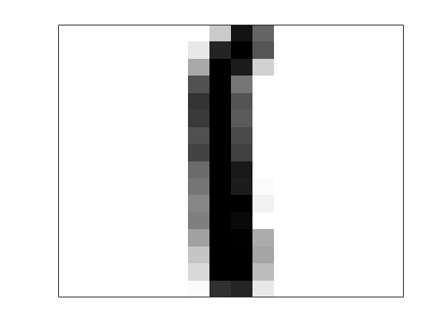
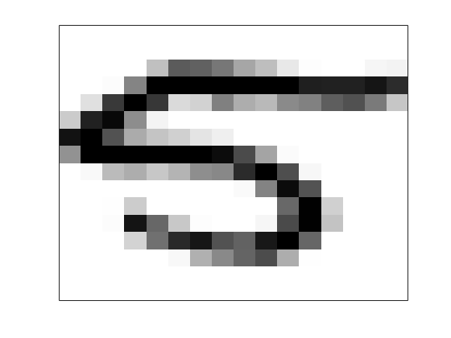
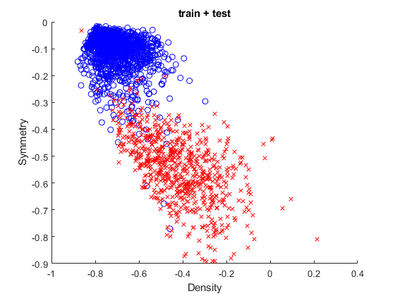
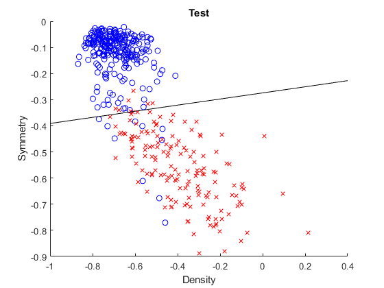
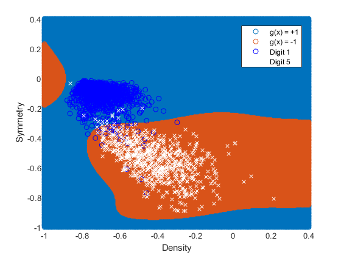
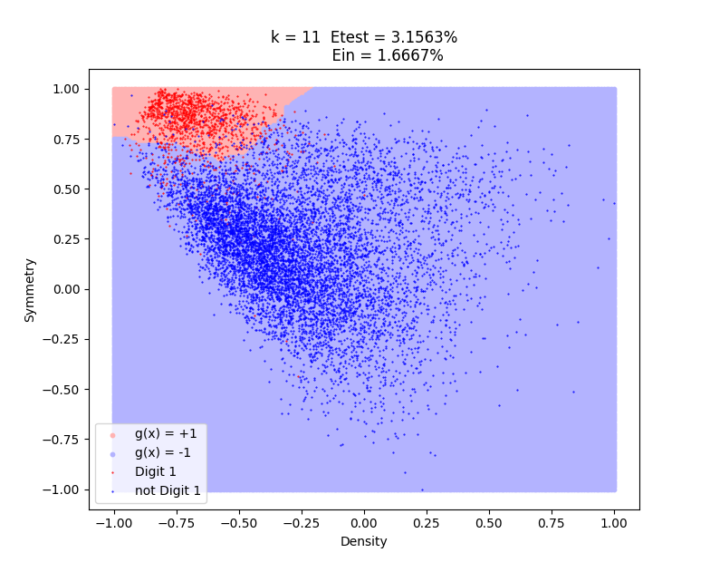
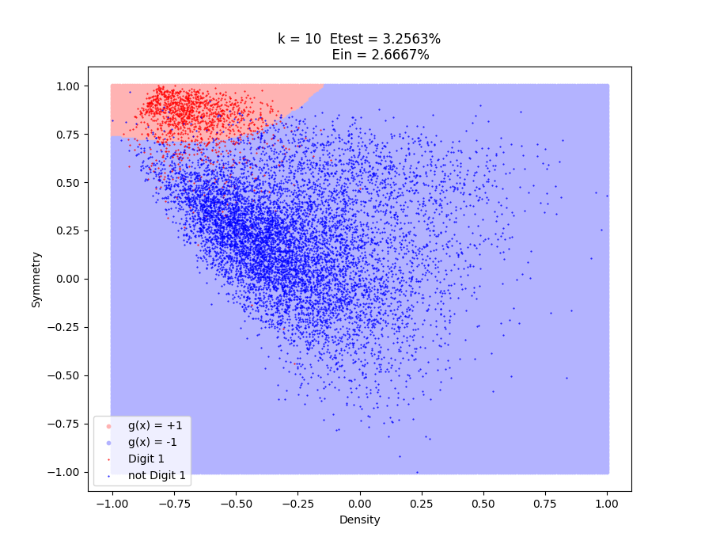
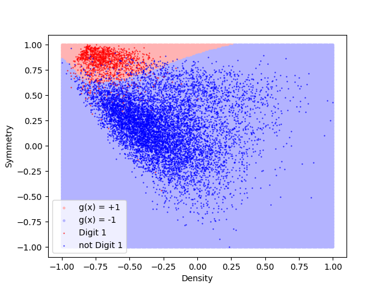
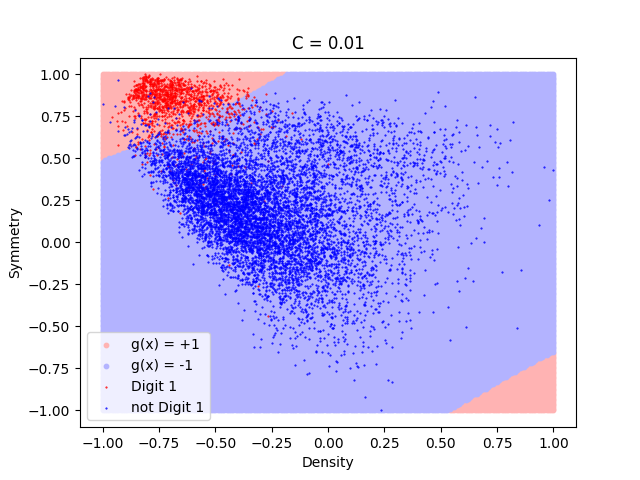

# Classifying Handwritten Digits: 1 vs. 5

|Example Digit 1      | Example Digit 5     |
|---------------------|---------------------|
| | |

## Preprocessing
- Filtered the original dataset to contation only digits 1 and 5
- Set +1 as the label for a digit 1 and -1 for a digit 5

## Methods
- Defined two features: symmetry and density

{:height="300px"}

- Linear Regression

{:height="300px"}

- Linear Regression with Kernel and regration $\lambda = 0.0774$

{:height="300px"}

- k-NN

{:height="300px"}

- RBF-network with Gaussian kernel, $r = 2/\sqrt{k}$

{:height="300px"}

- Neural Network

{:height="300px"}

- SVM

{:height="300px"}
